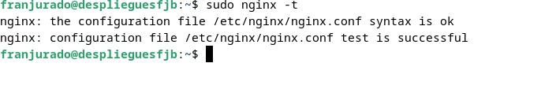

# PRÁCTICA DE AMPLIACIÓN

## Configuración de la práctica y objetivo

El propósito principal de esta práctica es implementar y configurar un servidor web utilizando Nginx, aprovechando su capacidad para gestionar hosts virtuales. Esto permitirá alojar múltiples sitios web en un solo servidor, optimizando recursos y simplificando la administración del sistema. Cada host virtual estará configurado de manera que apunte al directorio public_html correspondiente a distintos usuarios del sistema operativo Debian.
Al hacerlo, se habilitará un entorno donde cada usuario del sistema pueda gestionar y personalizar su propio sitio web desde su carpeta personal, sin interferir con los sitios de otros usuarios.
Este enfoque es especialmente útil en entornos compartidos, como servidores de desarrollo, académicos o de pequeñas empresas, donde un único servidor físico o virtual puede atender las necesidades de múltiples usuarios y sitios web.

Usaremos una conexión mediante SSH :


## Documentación

### 1. Instalación Nginx 

Creamos una nueva máquina virtual destinada para esta práctica:


Tenemos que actualizar previamente la lista de paquetes de los repositorios del sistema para luego instalar las versiones más recientes con el comando siguiente:

```sudo apt update && sudo apt upgrade -y```


Y nos dispondremos a instalar nginx con el siguiente comando:
```sudo apt install nginx -y```


Y para ver que se ha instalado correctamente y que su estado es activo, usaremos el ya conocido comando ```sudo systemctl status nginx```


### 2. Creación de usuarios del sistema

Para este segundo paso tendremos que crear dos usuarios del sistema operativo. Usaremos los siguientes comandos para ello:

```sudo adduser <nombre_usuario>```

Usaremos el nombre ```usuario1``` y ```usuario2``` para no complicarnos.


Tendremos ya los 3 usuarios en el sistema:


### 3. Estructura de carpetas y Archivos

1. El primer paso que deberemos hacer es crear la carpeta ```public_html``` en los directorios de cada usuario con el comando ```sudo mkdir /home/nombreUsuario/public_html```


2. Ahora tenemos que asignar los permisos a cada usuario creado sobre su directorio con el comando ```sudo chown -R nombreUsuario:nombreUsuario /home/nombreUsuario/public_html``` y ```sudo chmod 755 /home/nombreUsuario```


3. Ahora como último paso tenemos que crear una página web de prueba en el directorio ```public_html``` de los respectivos usuarios. Por eso cambiaremos de usuario con ```su nombreUsuario``` y creamos el archivo de la página web con el comando ```echo "<h1>Bienvenido al sitio de nombreUsuario</h1>" > /home/nombreUsuario/public_html/index.html```. Tendremos que repetir dicho comando con los dos usuarios.


### 4. Configuración básica de Nginx y creación de host virtuales

En este cuarto paso tenemos que borrar los sitios habilitados en nuestro servidor Nginx para evitar problemas. Si hemos realizado una instalación solo tendremos que borrar el ```default``` con ```sudo rm /etc/nginx/sites-enabled/default```.


Ahora crearemos el siguiente archivo de configuración para los hosts virtuales en el directorio sites-available de cada uno de los usuarios:

```sudo nano /etc/nginx/sites-available/usuario1```

```sudo nano /etc/nginx/sites-available/usuario2```


Habilitaremos ahora los enlaces simbólicos de ambas páginas con ```sudo ln -s /etc/nginx/sites-available/nombreUsuarios /etc/nginx/sites-enabled/```


Probamos que la configuración es toda correcta y no presenta ningún error, para ello usamos el comando ```sudo nginx -t```



Como último paso vamos a reiniciar Nginx con ```sudo systemctl restart nginx``` y luego probamos con ```sudo systemctl status nginx``` que va todo bien.


### HTTPS

```bash
sudo openssl req -x509 -nodes -days 365 -newkey rsa:2048 \
    -keyout /etc/nginx/ssl/nginx-selfsigned.key \
    -out /etc/nginx/ssl/nginx-selfsigned.crt
```


Modificamos los archivos de configuración:

Empezamos por la ruta ```hosts``` de la máquina anfitriona de windows:


```bash 
    server {
    listen 443 ssl;
    server_name usuario1.local;

    ssl_certificate /etc/nginx/ssl/nginx-selfsigned.crt;
    ssl_certificate_key /etc/nginx/ssl/nginx-selfsigned.key;

    root /home/usuario1/public_html;
    index index.html;

    location / {
        try_files $uri $uri/ =404;
    }
}
```

Modificamos el archivo de configuración de nginx de la ruta ```/etc/nginx/sites-available/usuarioX``` con ambos usuarios.


Modificaremos también el tema de los permisos en sus respectivas carpetas para que el usuario ```www-data```, que es el que se encarga de ejecutar los procesos web pueda ejecutarlo.


Hacemos lo mismo con el ```usuario2```. 

Y ya por fin accedemos a ambos directorios para ver los resultados en el navegador:

```Bienvenida del usuario1```


```Bienvenida del usuario2```


