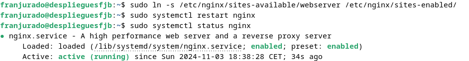
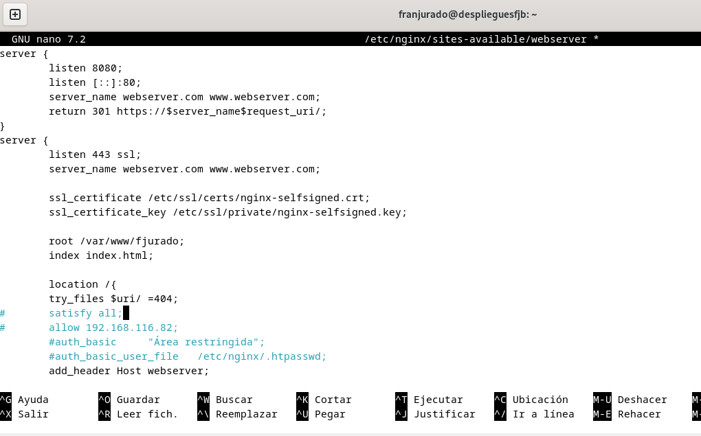
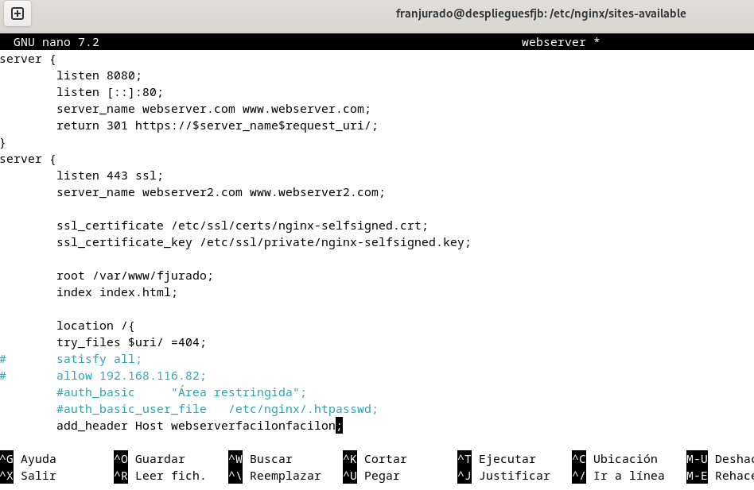
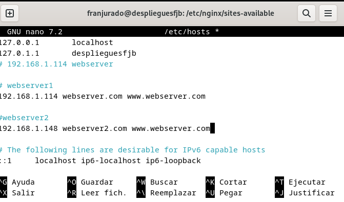
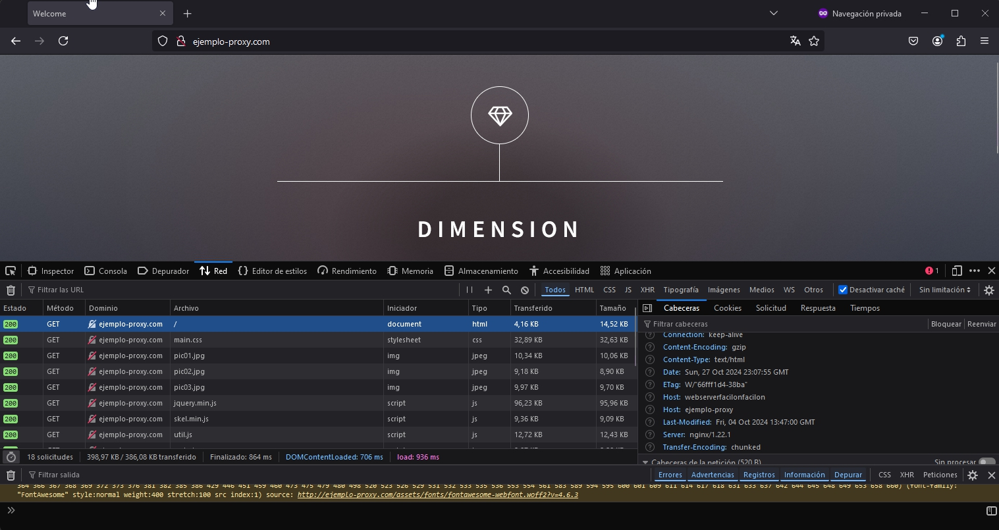

# PRÁCTICA 2.4 - Balanceo de carga con proxy inverso en Nginx

Esta práctica presenta el concepto de balanceo de carga usando un proxy inverso con Nginx. Aprenderemos a distribuir el tráfico entre múltiples servidores para mejorar la disponibilidad y eficiencia de un servicio web. El propósito es configurar un proxy inverso que dirija las solicitudes a dos servidores distintos, asegurando el acceso incluso si uno de ellos deja de funcionar. También exploraremos diversos métodos de balanceo para identificar el más adecuado según cada situación.

## Configuraciones

Se configurarán servidores web Nginx en dos máquinas con Debian y se reutilizará el proxy inverso Nginx.
- Cada servidor web mostrará un sitio específico.
- El servidor web 2 deberá contar con una IP asignada de forma estática mediante DHCP.
- El proxy inverso se ajustará para llevar a cabo el balanceo de carga.

Las peticiones HTTP se realizarán desde un navegador en nuestra máquina anfitriona.

Al acceder a http://balanceo, se observará cómo las solicitudes se distribuyen entre el servidor 1 y el servidor 2.

`Desactivaremos los sitios web de las prácticas anteriores para que podamos trabajar: `

Volvemos a crear el link simbólico y reiniciamos Nginx.

### Nginx Servidor web 1 
Vamos a mantener la máquina debian de la práctica anterior, la de `webserver`. Seguirá escuchando el puerto 8080 y se le añadirá su correspondiente cabecera.

Una vez hecho ésto, vamos a proceder a hacerle una clonación de la máquina virtual para utilizarla como servidor 2.

### Nginx Servidor web 2 

Aquí nos serviremos de la máquina virtual clonada, como mencionamos arriba. Será la webserver2, y tendremos que modificar el nombre en el apartado de `servername` para ponerle `webserver2`. 
Seguirá igual que la otra, escuchando al puerto 8080 y le modificaremos la cabecera para que sea distinto al otro servidor.

Guardamos cambios y pasamos a la siguiente fase.

## Configuración Nginx inverso

Ahora vamos a configurar el servidor proxy de la práctica anterior para que éste realice el reparto correspondiente de peticiones. Para ello deberemos modificar en el archivo de configuración un bloque `upstring` donde hagamos referencia con el nombre a ambos servidores, ya correctamente configurados.

También debemos modificar el archivo correspondiente en hosts para añadir la ip de los servers. En su respectiva ruta `/etc/hosts`:

## Comprobaciones

Al acceder al sitio web, a través de la URL que pusimos `ejemplo-proxy.com` podemos comprobar que no hay ningún problema. Si refrescamos la ventana nos damos cuenta que cada vez nos pone una cabecera distinta, que era la finalidad de nuestra práctica, alternar y balancear la carga.

Aquí tenemos la cabecera del primer webserver, y al refrescar obtenemos la del otro, abortándonos la primera.

Si pausamos uno de los servidores, mediante el comando `sudo systemctl stop nginx`, podemos comprobar que sigue direccionando al servidor que aún permanece activo. Ésto es un buen salvoconducto para evitar que los usuarios puedan seguir accediendo a nuestras páginas web en caso de fallo técnico.

Como podemos ver, al parar el primer server, no impide que no podamos acceder. Esto es aplicable aunque se parase el otro servidor, pues ambos tienen el mismo peso.

## Cuestiones finales

### Cuestión 1
Los métodos de balanceo de carga más utilizados que he encontrado son los siguientes:

1. Round Robin: Este método asigna las solicitudes a los servidores de manera secuencial, es decir, va turnando las peticiones entre los servidores disponibles uno tras otro.

2. Least Connections: Con este método, la solicitud se dirige al servidor que tenga la menor cantidad de conexiones activas en ese momento, lo que permite equilibrar la carga según el uso actual de cada servidor.

3. IP Hash: Aquí se utiliza la dirección IP del cliente para determinar el servidor al que se enviarán sus solicitudes. Esto asegura que el mismo cliente sea dirigido siempre al mismo servidor, útil para mantener sesiones o preferencias de usuario.

### Cuestión 2
El bloque de configuración `server` es el encargado de redirigir el tráfico hacia los `backend_hosts`, que representan el grupo de servidores definidos previamente en el bloque `upstream`. Este bloque `upstream` establece cómo se manejarán las redirecciones y qué método de balanceo de carga se usará. Aquí es donde se añadirán los servidores, especificando primero la IP del servidor, seguida del puerto al que este escucha, separado por dos puntos.

### Cuestión 3
Para configurar el balanceo de carga, debemos seguir dos pasos principales:

1. Definir el bloque `upstream`: En este bloque, se incluirán las IP y los puertos de los servidores que recibirán las solicitudes, configurando así el grupo de servidores para el balanceo.

2. Configurar el bloque `location`: Dentro de este bloque, utilizaremos la directiva `proxy_pass` para redirigir las solicitudes entrantes hacia los servidores que hemos definido en el bloque `upstream`.

