# PRÁCTICA 3.1: Instalación de Tomcat
## Instalación de Tomcat
1. Instalación de Java
En el caso de que no lo tengamos instalado Java, instalaremos el jdk
```sudo apt install default-jre```
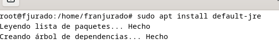
Podemos comprobar la versión instalada con el siguiente comando: 
```java -version```
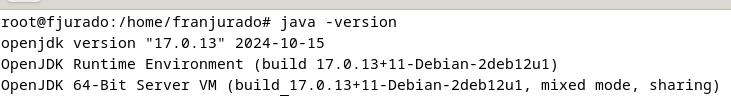
2. Tomcat
Instalaremos la versión 10 de Tomcat
```sudo apt install tomcat10 tomcat10-admin```

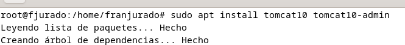
Posteriormente tendremos que crear el usuario para Tomcat. Y para ello, lo que debemos modificar es el archivo ```tomcat-users.xml``` 
y quedará de la siguiente forma: 
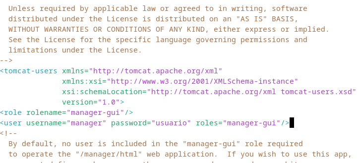
Cuando ya hayamos configurado el archivo procederemos a reiniciar el servicio Tomcat con el siguiente comando: ```sudo systemctl restart tomcat```. Y comprobaremos que el servicio se ha iniciado correctamente usando ```sudo systemctl status tomcat```. Deberá aparecernos algo como lo siguiente:

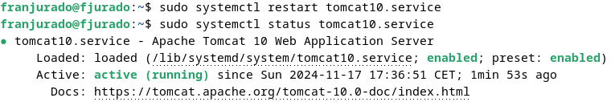

## Despliegue manual mediante la GUI de administración

Accederemos a la dirección ```http://localhost:8080/nombre_usuario/html y nos aparecerá algo así:


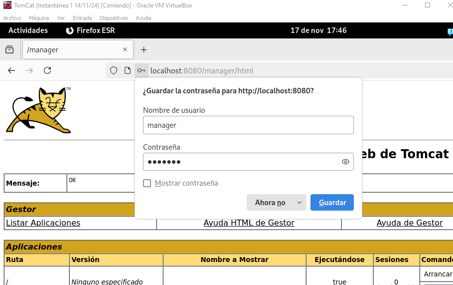

Cuando hayamos hecho la comprobación de que Tomcat se ha instalado correctamente, procederemos a intentar desplegar un archivo ```.war``` en Tomcat. Hay que aclarar que el archivo correspondiente al ```.war``` que se nos facilitó tiene errores y realizaremos la prueba con otro archivo ```.war``` de ejemplo.

Desde este enlace lo descargaremos: ```https://tomcat.apache.org/tomcat-6.0-doc/appdev/sample/```

Lo seleccionamos y lo desplegamos:

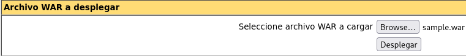
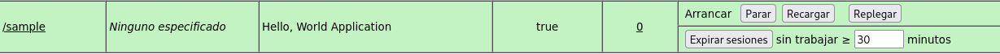

Y accedemos para ver que está correctamente desplegado:

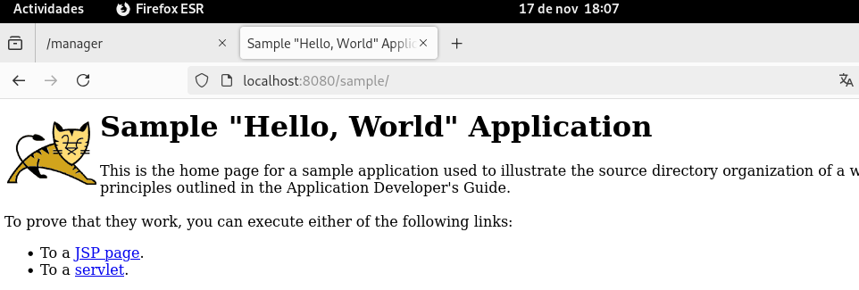

## Despliegue con Maven

### Instalación de Maven

Para el despliegue con Maven, tendremos que instalar Maven al igual que hicimos arriba con Tomcat:

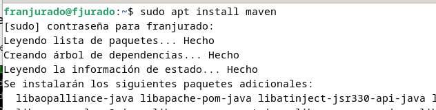

Podemos consultar la versión instalada con el comando: ```nvm --v```

### Configuración de Maven
Ahora lo que tenemos que hacer es añadir un nuevo usuario al archivo ```tomcat-users.xml``` para poder desplegar con Maven, y el archivo quedará ahora de la siguiente forma:

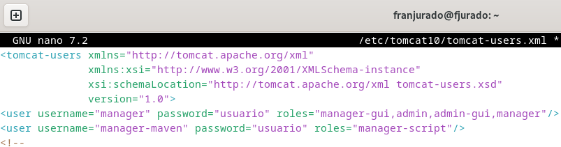

Una vez que tengamos hecho eso, tendremos que configurar Maven de la siguiente manera: Tenemos que modificar el archivo ```settings.xml```. Quedará de tal forma:

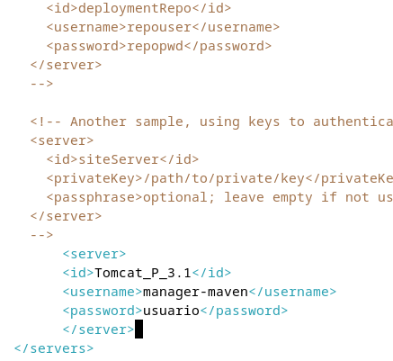

Ahora clonaremos el repositorio de ejemplo que se nos ha facilitado y lo desplegaremos con Maven:

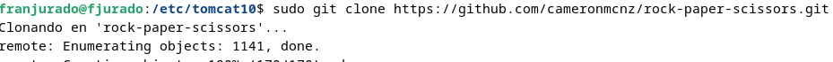

Cambiamos de rama para trabajar mejor: 
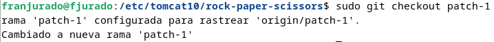

Ahora tenemos que editar el archivo ```pom.xml``` para añadirle la configuración. 
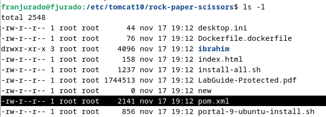

Tendrá que quedar así:

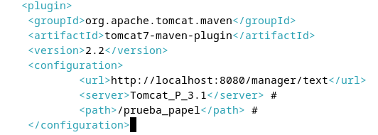

### Despliegue
Usaremos el comando ````mvn tomcat7:deploy``` para desplegarlo:

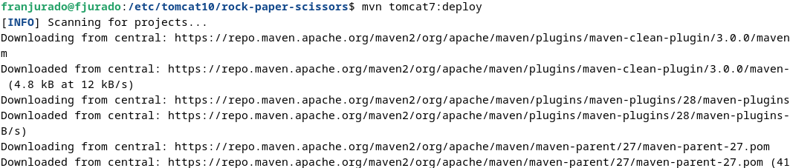

Y al acceder a la dirección ```http://localhost:8080/nombre_usuario/``` nos debe aparecer algo como lo siguiente:


Y si se accede al archivo nos debe aparecer lo siguiente:

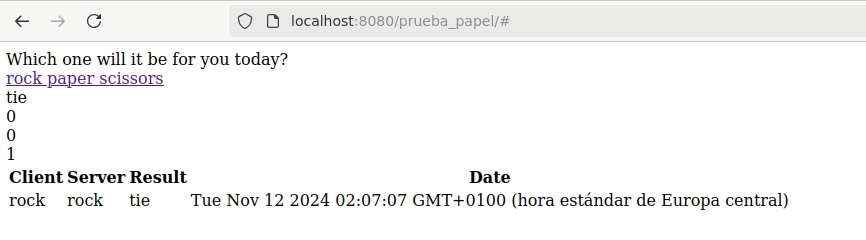

## CUESTIONES

**Habéis visto que los archivos de configuración que hemos tocado contienen contraseñas en texto plano, por lo que cualquiera con acceso a ellos obtendría las credenciales de nuestras herramientas. En principio esto representa un gran riesgo de seguridad, ¿sabrías razonar o averigüar por qué esto está diseñado de esta forma?**

Guardar contraseñas en texto plano dentro de archivos de configuración no es seguro, aunque a menudo se recurre a ello por motivos prácticos. Esto puede simplificar el acceso durante el desarrollo, garantizar compatibilidad con herramientas obsoletas o incluso mejorar el rendimiento en sistemas cerrados con bajos requerimientos de seguridad. Sin embargo, en entornos de producción es fundamental optar por alternativas más seguras, como el uso de cifrado o gestores de secretos, para proteger las credenciales adecuadamente.