# Práctica 4-1 Configuración de un servidor DNS
[0. Paso previo: Conexión por SSH](#0-paso-previo-conexión-por-ssh)  
[1. Instalación de servidor DNS](#1-instalación-de-servidor-dns)  
[2. Configuración](#2-configuración)  
[3. Configuración del archivo named.conf.options](#3-configuración-del-archivo-namedconfoptions)  
[4. Configuración del archivo named.conf.local](#4-configuración-del-archivo-namedconflocal)  
[5. Configuración del archivo db.deaw.es](#5-configuración-del-archivo-dbdeawes)  
[6. Creación del archivo de zona para la resolución inversa](#6-creación-del-archivo-de-zona-para-la-resolución-inversa)  
[7. Comprobación de la configuración](#7-comprobación-de-la-configuración)  
[8. Comprobación del funcionamiento (resoluciones y de las consultas)](#8-comprobación-del-funcionamiento-resoluciones-y-de-las-consultas)  
[9. Cuestiones Finales](#9-cuestiones-finales)

___________________________________________________________
## 0. Paso previo: Conexión por SSH

Como paso previo a la instalación podemos y deberíamos conectarnos por SSH a nuestra máquina física en todas las prácticas.
Podemos hacerlo de esta forma: 

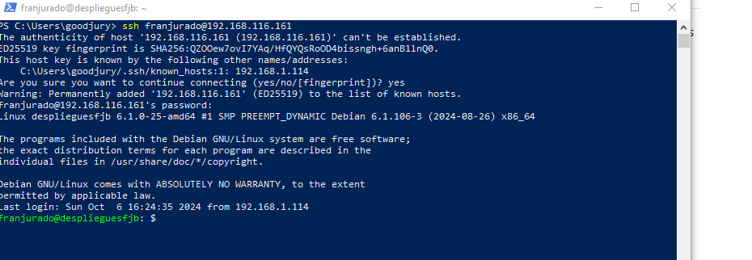

Otra posible opción es configurar desde VirtualBox la máquina virtual, usando el modo ```NAT``` en la sección ```Red```.
Configuramos en la sección avanzada el ```Reenvío de puertos```. Y agregamos una nueva regla: 

    Anfitrión: 127.0.0.1 (IP de la máquina host)
    Puerto anfitrión: 2222 (o cualquier puerto disponible)
    Invitado: IP de su máquina virtual
    Puerto invitado: 22

Es necesario tener instalado el servidor SSH y funcionando en la máquina virtual.
Se puede instalar con ```sudo apt-get install openssh-server```

## 1. Instalación de servidor DNS
Lo primero que debemos hacer es instalar ell servidor DNS en el servidor de prácticas. Para ello, nos lo vamos a instalar con el siguiente comando:

```
sudo apt-get install bind9 bind9utils bind9-doc
```

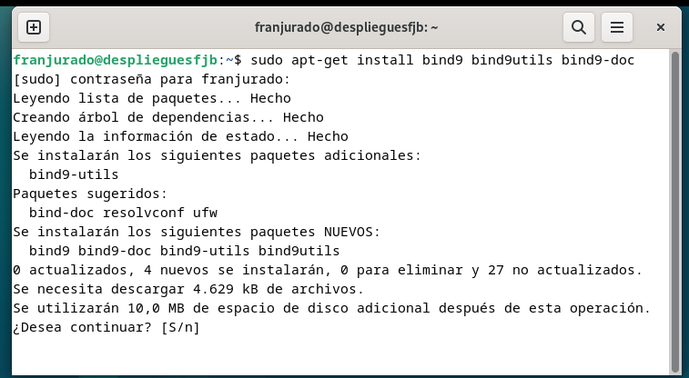

## 2. Configuración
Ahora, debemos editar el correspondiente archivo de configuración de Bind para que podamos usar IPv4, que es el que nos interesa. Por tanto tewnemos que usar el comando ```sudo nano /etc/default/named```
Y le añadimos en la línea donde tenemos OPTIONS el valor ```-u bind -4```

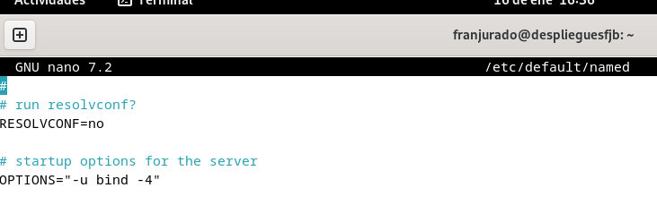

Para comprobar que la configuración del servidor DNS es correcta, comprobaremos el archivo correspondiente a ```/etc/bind/named.conf```

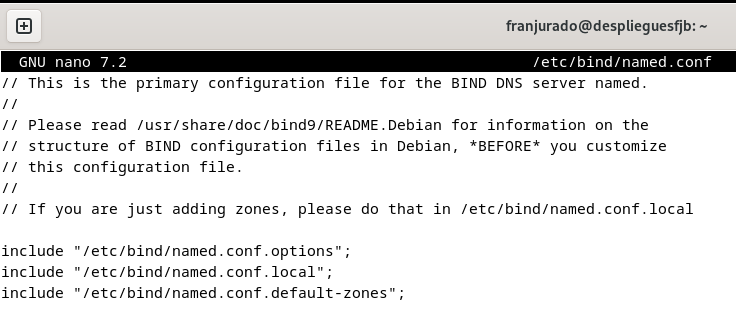

## 3. Configuración del archivo named.conf.options
Ahora como paso previo y tal y como nos recomienda el repositorio de ```https://raul-profesor.github.io/``` vamos a realizarle una copia de seguridad al archivo que vamos a modificar y que nos interesa tenerlo como posible punto de recuperación en caso de que tengamos algún problema.

Por eso tenemos que usar el siguiente comando en nuestra terminal: ```sudo cp /etc/bind/named.conf.options /etc/bind/named.conf.options.backup```. 

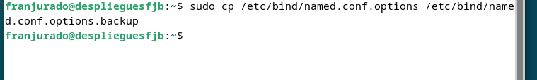

Una vez que ya hemos hecho el ```backup``` continuaremos con los siguientes pasos de la práctica. Ahora lo que toca es editar el archivo ```named.conf.options``` con el comando: ```sudo nano /etc/bind/named.conf.options```

Lo que haremos es limitar el acceso a peticiones recursivas al servidor en el archivo para los hosts que nos interesen. 
Para eso, debemos agregar la siguiente línea de código al archivo: ```acl confiables { 192.168.X.0/24};```
Nuestra IP de la máquina del servidor es ```192.168.116.161 /24```, por lo tanto tendríamos que coger el valor 116 en la X.

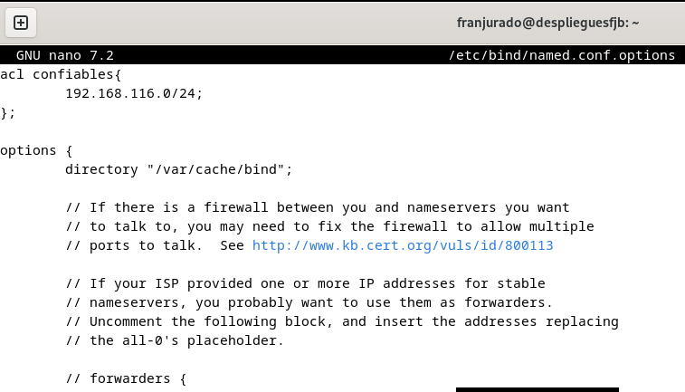


Y después de los forwarders tenemos que agregar lo siguiente: ```allow-recursion { confiables; };``` ```allow-transfer { none; };``` ```listen-on port 53{192.168.X.X}``` ```recursion yes```

Y quitamos ```listen-on-v6``` , comentando la línea por si nos hiciera falta en el futuro.

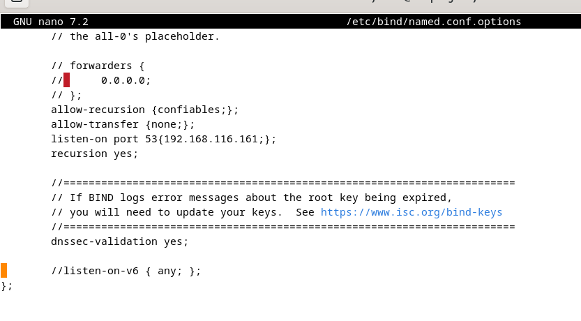

Y ahora vamos a comprobar si la configuración introducida es correcta con el siguiente comando: ```sudo named-checkconf```

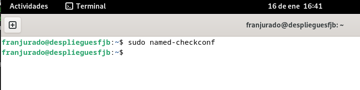

Y ahora para curarnos en salud, reiniciamos y comprobamos que el servicio marcha correctamente: 

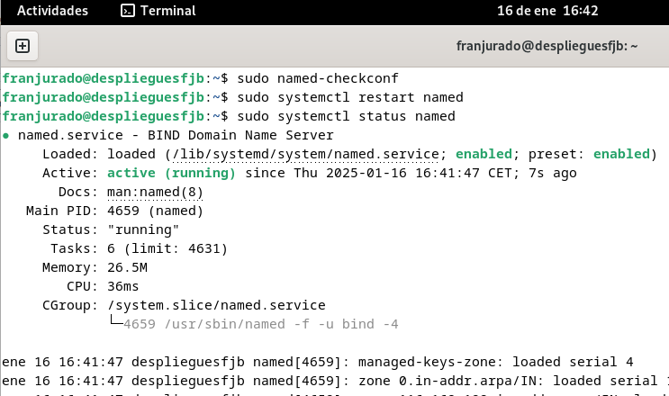

## 4. Configuración del archivo named.conf.local

En este archivo vamos a configurar las zonas, y para esta práctica declaramos la zona deaw.es.
Mediante el comando ```sudo nano /etc/bind/named.conf.local``` y añadimos:

```
zone "deaw.es" {
    type master;
    file "/etc/bind/db.deaw.es";
};
```

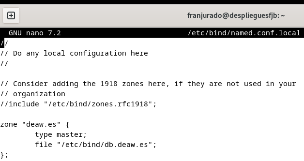

## 5. Configuración del archivo db.deaw.es
Ahora vamos a crear el archivo ```db.deaw.es``` en la ruta ```/etc/bind/```.

Y le tenemos que añadir todo lo siguiente:

```
@       IN      SOA     debian.deaw.es. admin.deaw.es. (
                        2022112001 ;Serial
                        3306       ;Refresh
                        1800       ;Retry
                        604800     ;Expire
                        86400      ;Minimun TTL
                        )

        IN NS debian.deaw.es.

debian  IN A 192.168.116.161
```

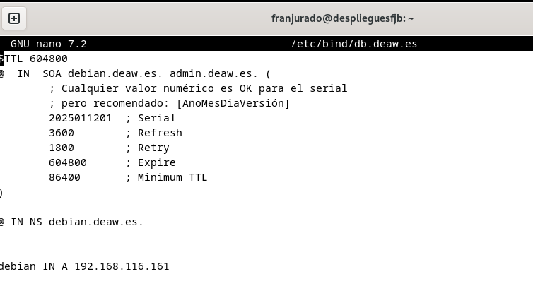

## 6. Creación del archivo de zona para la resolución inversa

Aquí tendremos que entrar en el archivo ```named.conf.local``` y debemos introducir las zonas de la misma forma que hicimos con la resolución directa. A continuación crearemos un archivo para la resolución inversa. 

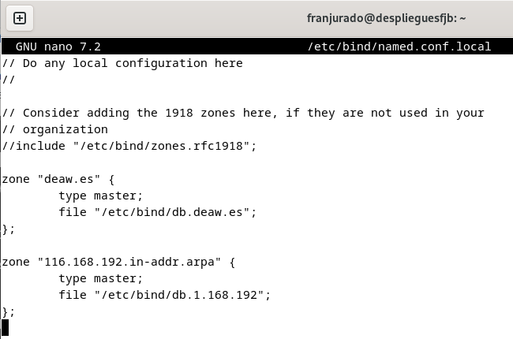

Éste sería el archivo correspondiente a la configuración de la zona inversa.

Tenemos que crear el archivo de zona para la resolución inversa, que se llamará ```db.1.168.192```, y lo configuramos de la siguiente manera:

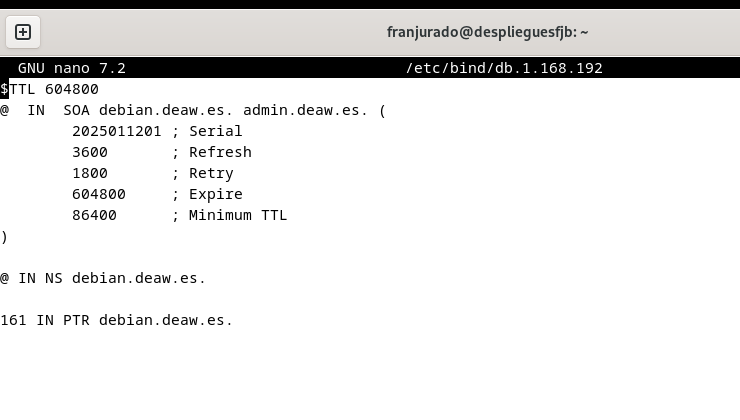


## 7. Comprobación de la configuración

En este séptimo punto vamos a encargarnos de las comprobaciones correspondientes a las configuraciones que hemos realizado. Para ello usaremos dos comandos: ```sudo named-checkzone db.deaw.es db.1.168.192``` y al revés ```sudo named-checkzone db.1.168.192 db.deaw.es```. De esta forma deberemos obtener el OK con sus respectivos datos.

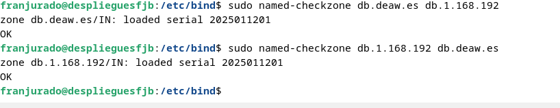

Vemos que funciona correctamente, reiniciamos el servicio ```sudo systemctl restart named``` y vemos si funciona.

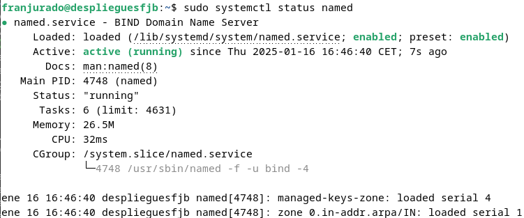

## 8. Comprobación del funcionamiento (resoluciones y de las consultas)

Ahora vamos a establecer el cliente, y vamos a usar otra máquina virtual Debian para ello (podemos también usar nuestra máquina física anfitriona). En ella vamos a configurar el archivo ```/etc/resolv.conf``` de ésta máquina poniéndole la dirección IP del servidor DNS. Tiene que quedar de esta forma: 

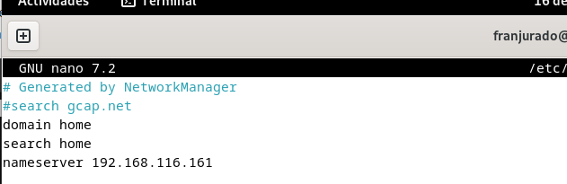

Después ya podemos comprobar la resolución directa e inversa, para estar seguros de que funcionan de forma correcta y no hemos tenido ningún error. Hay que ejecutar el comando ```dig debian.deaw.es``` , ```dig -x 192.168.116.161``` (usando la IP de la máquina virtual que actúa de servidor).

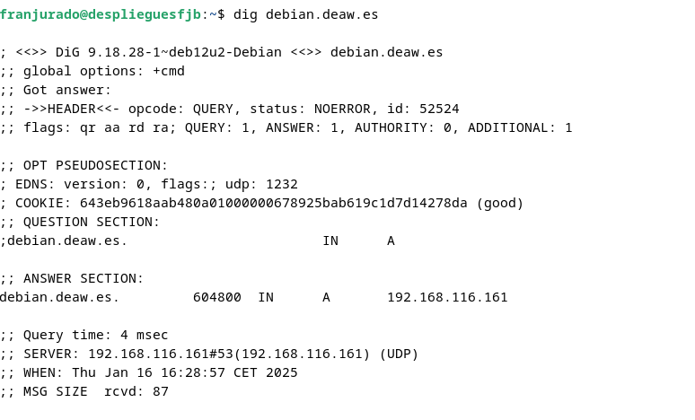


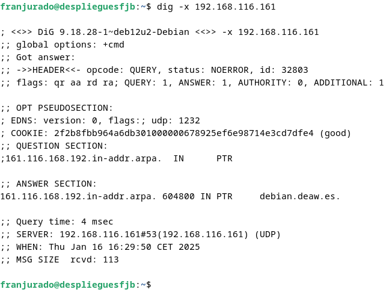

Por último usamos el comando ```nslookup``` para realizar una consulta al sistema DNS y obtener la correspondiente información que nos ayude a verificar si hay algún problema de red.

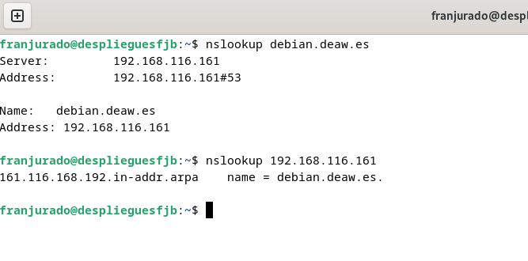

## 9. Cuestiones Finales

### Cuestión 1: ¿Qué pasará si un cliente de una red diferente a la tuya intenta hacer uso de tu DNS de alguna manera, le funcionará? ¿Por qué, en qué parte de la configuración puede verse?

Si un cliente de una red diferente intenta usar tu DNS, probablemente no funcionará (no debería funcionar). Esto se debe a la configuración de la ACL (Lista de Control de Acceso) que restringe las consultas a hosts específicos.
Puede verse en la directiva ```allow-recursion {confiables;};```

### Cuestión 2: ¿Por qué tenemos que permitir las consultas recursivas en la configuración?

Permitimos las consultas recursivas en la configuración para que el servidor DNS pueda realizar búsquedas completas y proporcionar respuestas definitivas a las consultas de los clientes autorizados

### Cuestión 3: ¿El servidor DNS que acabáis de montar, es autoritativo? ¿Por qué?

Se han definido zonas primarias con ````"type master;"```. El servidor DNS que se ha montado es autoritativo para las zonas que se han configurado en él. Es autoritativo porque contiene los registros de recursos originales para esas zonas específicas. 

### Cuestión 4: ¿Dónde podemos encontrar la directiva $ORIGIN y para qué sirve?

La directiva $ORIGIN se encuentra en el archivo de zona DNS. Sirve para especificar el dominio base para los nombres de host en esa zona, permitiendo usar nombres relativos en los registros.

### Cuestión 5: ¿Una zona es idéntica a un dominio?

Una zona no es idéntica a un dominio. Una zona es una porción del espacio de nombres de dominio que se administra como una unidad, mientras que un dominio es una estructura jerárquica en el sistema de nombres.

### Cuestión 6: ¿Pueden editarse los archivos de zona de un servidor esclavo/secundario?

No, los archivos de zona de un servidor esclavo/secundario no deben editarse directamente. Estos se actualizan automáticamente mediante transferencias de zona desde el servidor maestro.

### Cuestión 7: ¿Por qué podría querer tener más de un servidor esclavo para una misma zona?

Tener más de un servidor esclavo para una misma zona proporciona redundancia, mejora la distribución de carga y aumenta la disponibilidad del servicio DNS.

### Cuestión 8: ¿Cuántos servidores raíz existen?

Hay 13 servidores raíz de la A a la M.

### Cuestión 9: ¿Qué es una consulta iterativa de referencia?

Una consulta iterativa de referencia es un proceso donde un servidor DNS responde a una consulta con la mejor información que tiene, generalmente apuntando a otro servidor DNS que puede tener más información sobre la consulta.

### Cuestión 10: En una resolución inversa, ¿a qué nombre se mapearía la dirección IP 172.16.34.56?

En una resolución inversa, la dirección IP 172.16.34.56 se mapearía a un nombre de dominio en el formato "56.34.16.172.in-addr.arpa"