## 0. Introducción
## 1. Instalación servidor web Nginx

## 2. Creación directorio del sitio web

## 3. Configuración de servidor web Nginx
### 3.1. Comprobaciones: Uso correcto y comprobar registros
### 3.2. FTP: Transferir archivos

_____________________________________________________________________________________________
# Introducción
Vamos a instalar el servidor Nginx en nuestra Debian creada anteriormente para configurarla y posteriormente agregar nuestro sitio web. Se probará también el método de transferencia de datos con FTP.

# Instalación servidor Nginx
Lo primero de todo erá actualizar el repositorio con el siguiente comando:
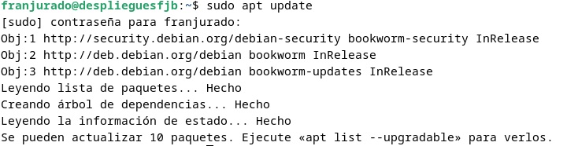

Y acto seguido se instalará el paquete de Nginx:
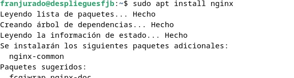

Podemos comprobar que se ha instalado correctamente y que está funcionando si introducimos:
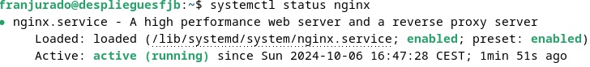

# Creación del directorio del sitio web
Al igual que en otros servidores, como en Apache, necesitamos un directorio organizado en carpetas para tener nuestro sitio web. Tal y como se explica en los manuales, suele estar en /var/www  , salvo que se haya modificado previamente.
Por tanto, nos disponemos a crear en la siguiente ruta nuestra carpeta para el dominio web:
La llamaremos "fjurado" y ella contendrá el subdirectorio "html".
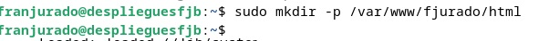

Como paso intermedio, en nuestro caso no tenemos instalado Git y no podremos realizar el siguiente paso, con lo cual haremos: 

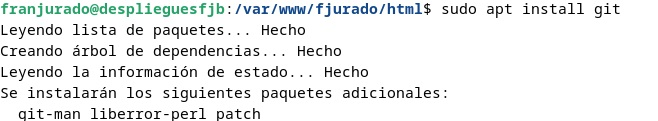
Después de instalar Git, en dicha carpeta tendremos que clonar el siguiente repositorio: 

https://github.com/cloudacademy/static-website-example

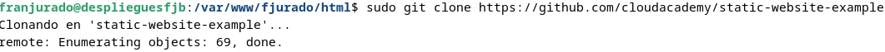

Es necesario cambiar la propiedad al directorio www-data, ya que es el usuario con el cual Nginx se ejecuta. Lo haremos de la siguiente forma:

Introduciendo la ip de nuestra máquina de Debian en el navegador, podemos comprobar que todo marcha correctamente, ya que nos saldrá algo igual a lo siguiente:

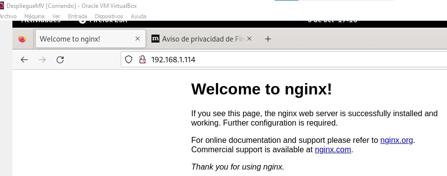

# Configuración Servidor Nginx

A continuación debemos configurar nuestro servidor. Para ello tenemos dos directorios importantes: sites-available(sitios que contiene el servidor) y sites-enabled(archivos de configuración de los sitios previamente habilitados).
Dentro de "sites-available" tendremos el directorio de nuestro sitio web.
Creamos un nuevo bloque con las directivas correctas, en vez de modificar el predeterminado, usando nuestro editor de texto preferido, en mi caso con "nano":
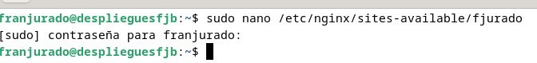

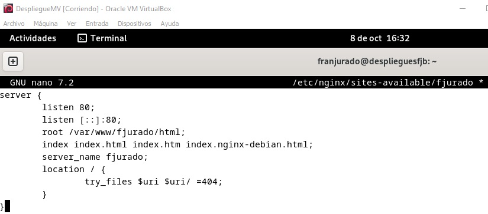

Incluímos el path de nuestro sitio web, y modificaremos en la directiva server_name añadiendo nuestro nombre.

Posteriormente vamos a crear un archivo simbólico entre este archivo y el de sitios que están habilitados con el siguiente comando:

**sudo ln -s /etc/nginx/sites-available/nombre_web /etc/nginx/sites-enabled/**

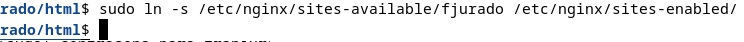

Y reiniciamos el servidor para que se apliquen los cambios:

## Comprobaciones

Al no disponer de un servidor DNS, deberemos introducir la ip de forma manual.
Lo primero de todo, y aunque ya tengamos la ip de nuestra máquina de Debian de prácticas anteriores, usaremos el siguiente comando para volver a disponer de ella:

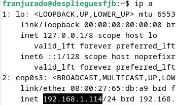

Habrá que editar el archivo /etc/hosts mediante un sudo nano:

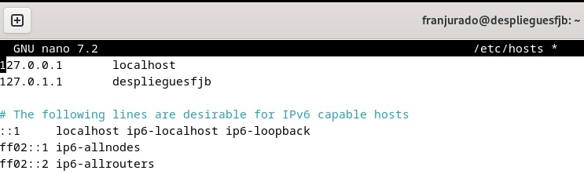

Y tenemos que añadirle la ip de la siguiente forma, seguida del nombre web:
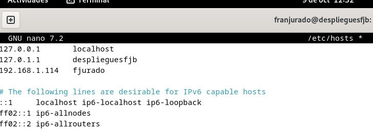

### Comprobación registros

A continuación vamos a comprobar que los registros se den de forma correcta, tanto los que se producen bien y sin problemas al realizarse una solicitud al servidor, como el log de cada error que aparezca.

Tenemos dos rutas principales: /var/log/nginx/access.log   y  /var/log/nginx/error.log
He preferido usar la opción "tail" en vez de cat, para poder obtener el log en tiempo real y así comprobar de una mejor forma el funcionamiento:
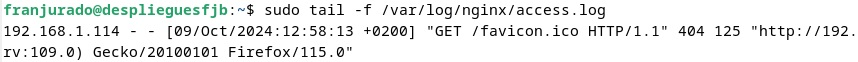
Como se puede observar, se realiza la petición de forma correcta.
En cambio, para el log de error no nos notifica ningún error y debemos salir del proceso con ctrl + Z.

### Configurar servidor SFTP
Dada la teoría de la práctica conforme a este sistema de transferencia de archivos, vamos a actualizar e instalar en primer lugar el vsftpd (es un servidor FTP ligero y seguro) en nuestra máquina:
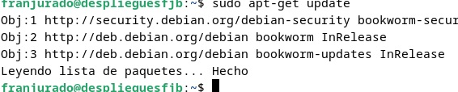
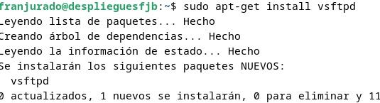

Crearemos una carpeta en nuestro directorio /home:
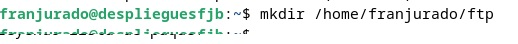

Y ahora habrá que configurar el vsftpd de la siguiente forma: 
    1. Lo primero que haremos será añadir los certificados de seguridad necesarios para añadir una capa de cifrado a nuestra conexión:
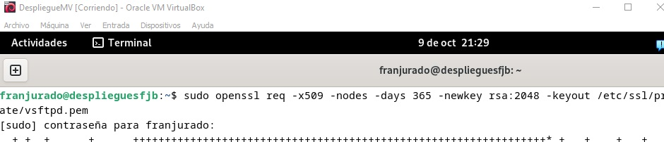

    2. Entraremos al archivo de configuración con "nano": 
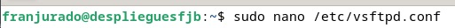

    Y tenemos que buscar las siguientes líneas:
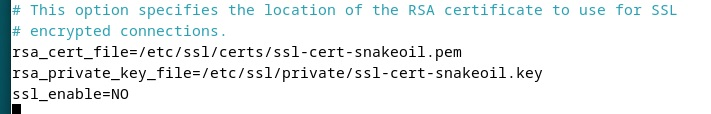
    para sustituirlas por las siguientes:
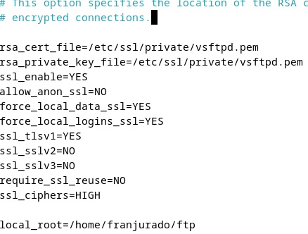

Volveremos a reiniciar el servicio para que se adapten los cambios:
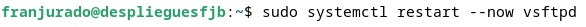

### Descargamos Filezilla y establecemos conexión

Debemos descargar el cliente de filezilla para nuestra máquina anfitriona, y en ella veremos una interfaz como la siguiente, donde tenemos que introducir la ip del servidor (en este caso nuestra máquina virtual Debian, que es donde tenemos alojado Nginx):
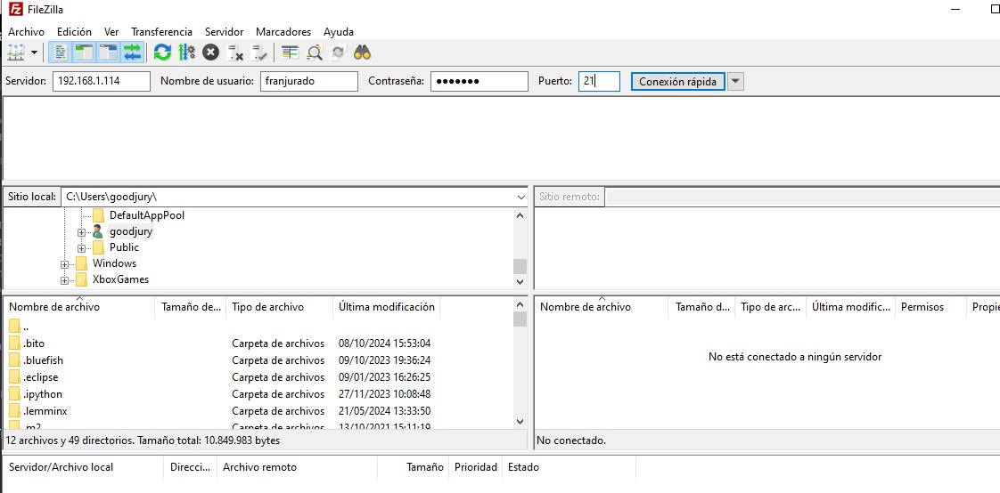

Como podemos observar, solo nos salen los datos de nuestra máquina física, con sus directorios disponibles. Despues de añadir la dirección ip, nuestro usuario y contraseña, asignamos el puerto 21, porque al ser una transferencia privada no tenemos ningún tipo de riesgo. En caso contrario y de forma opcional también se puede usar el puerto 22 para una transferencia más segura:

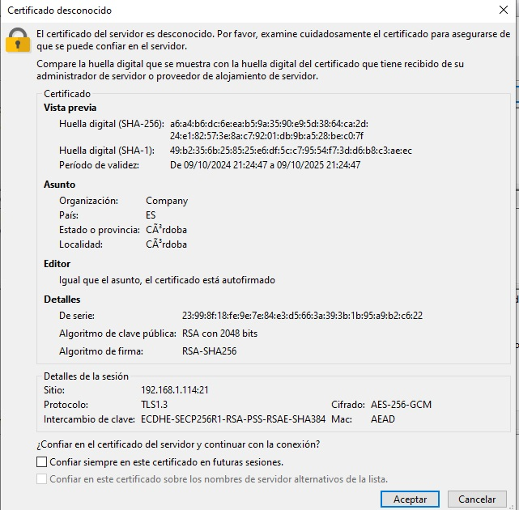

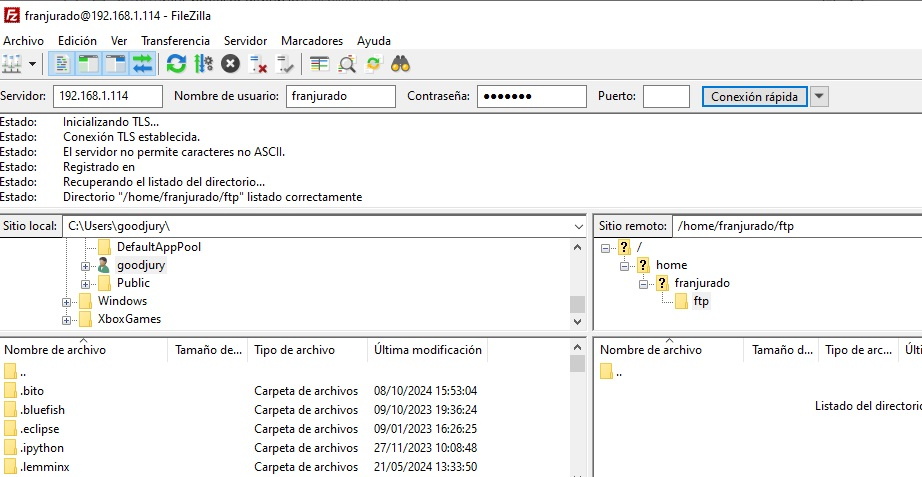

Tras aceptar ya tenemos la conexión establecida como podemos observar y podemos enviar cualquier archivo a través de Filezilla. Nos aparece a la derecha el directorio de nuestra Debian.

